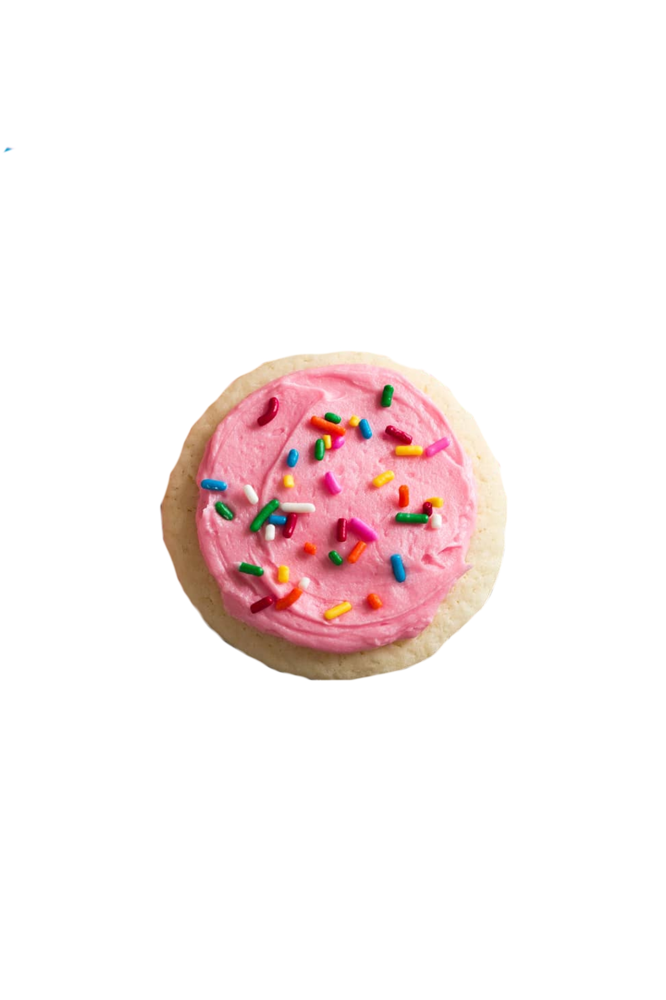
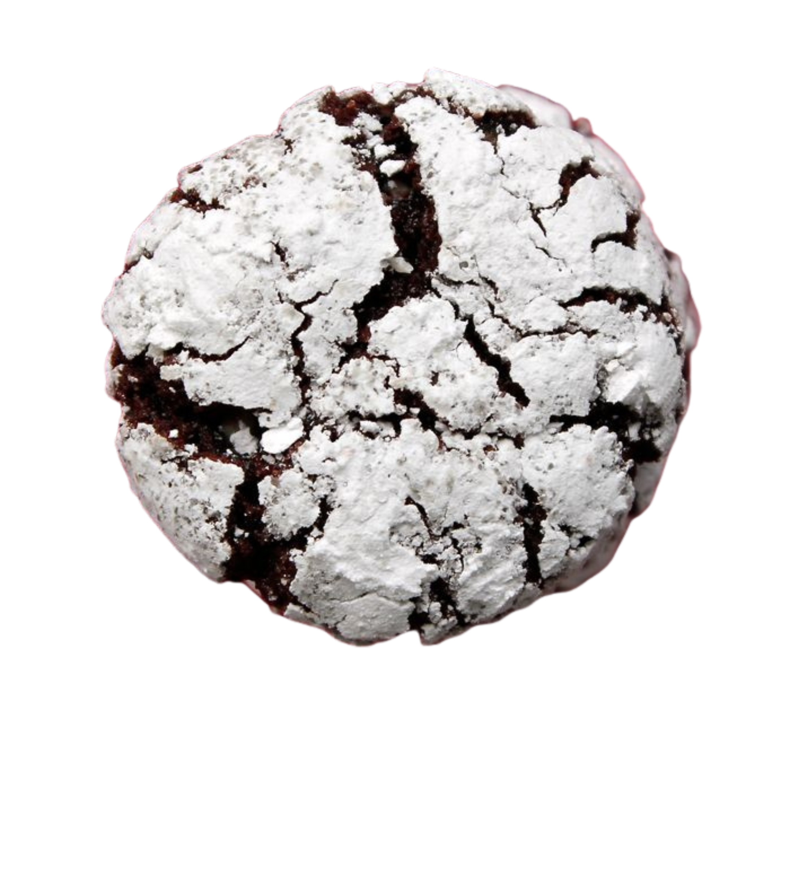
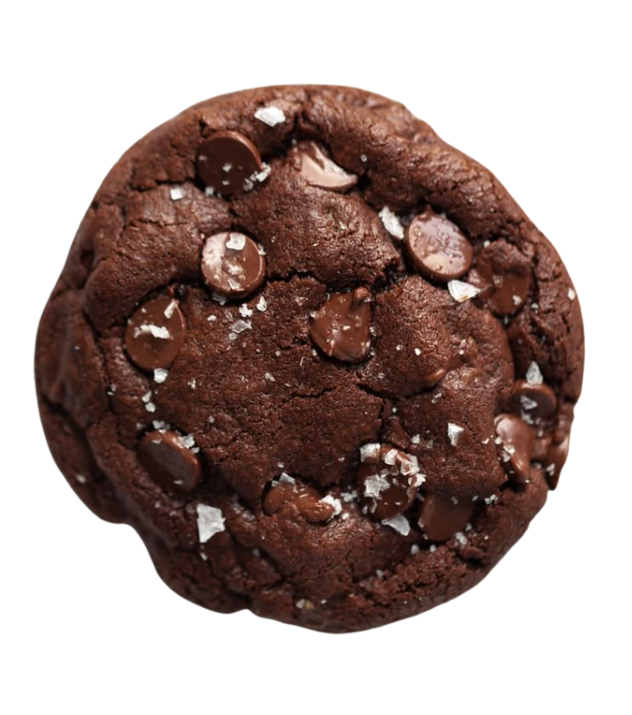
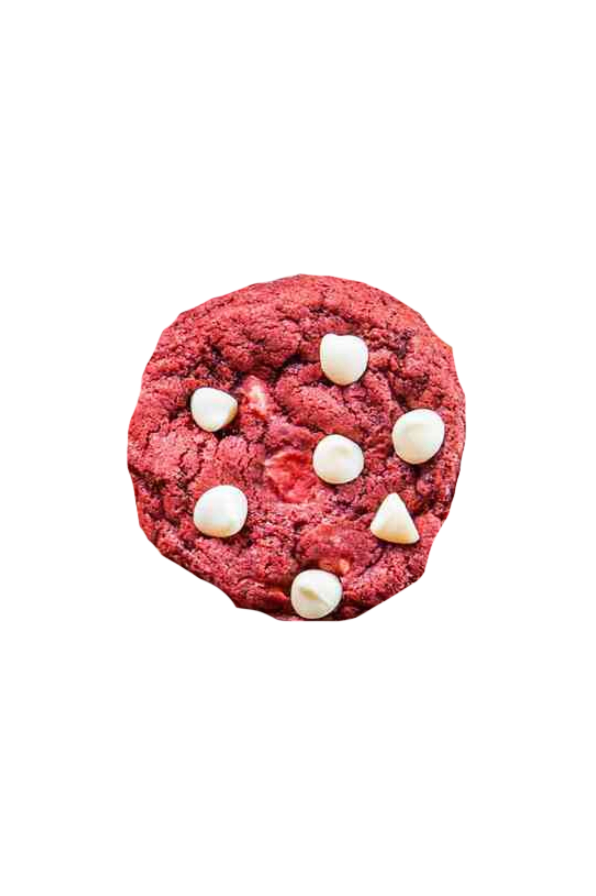
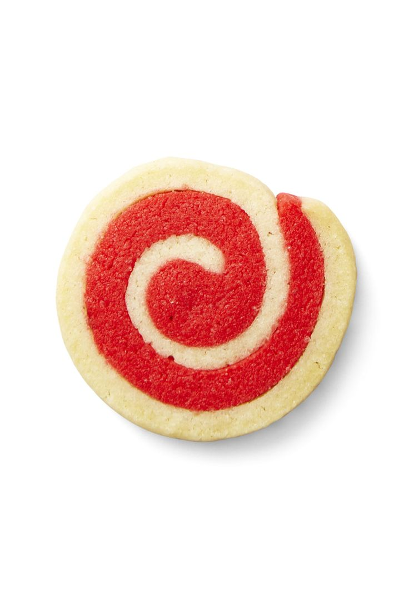
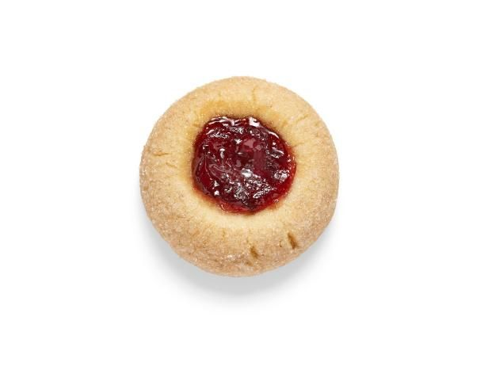
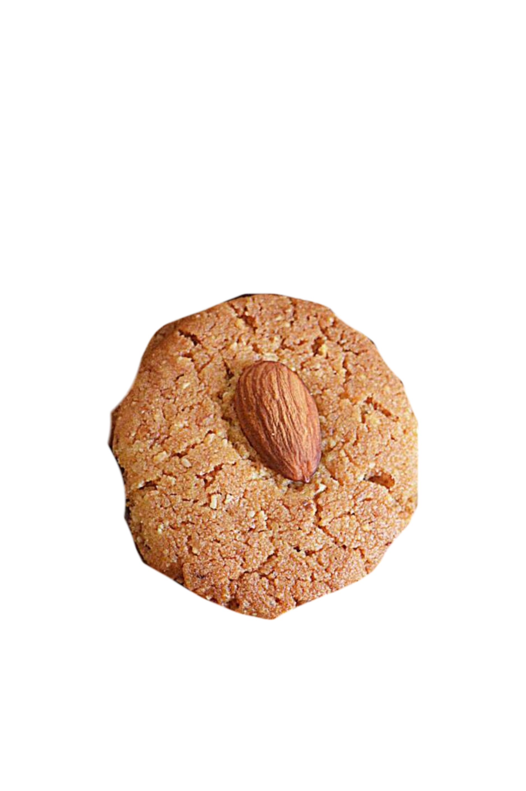
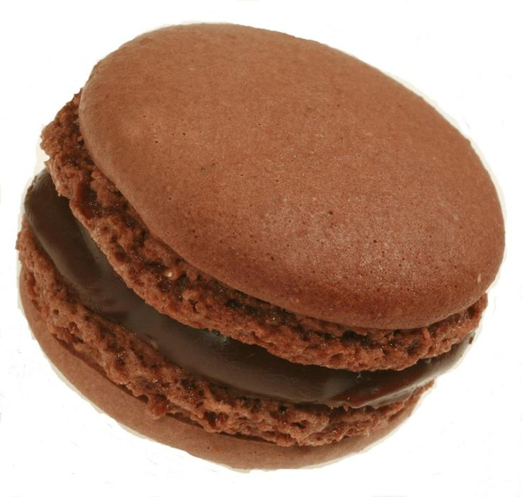

<!-- ================= HERO SECTION ================= -->
<div align="center">

<h1>
  
  Hi, I'm
</h1>


<br/>


</div>

---

## 🌱 About Me

- 💡 Developer passionate about **mobile applications and machine learning**
- 🎯 Focused on **Flutter development, UI/UX design, and AI-powered solutions**
- 🎓 This repository contains my **IT 120 Final Project - Cookie Finder**

---

## 🧰 Tech Stack

<div align="center">

| 💻 Category | ⚙️ Technologies |
|-----------|----------------|
| Languages | Dart, Python |
| Frameworks | Flutter |
| Backend | Firebase |
| ML Runtime | TensorFlow Lite |
| UI / UX | Material Design, Flutter Widgets |
| Tools | Git, VS Code, Android Studio |

</div>

---

## 🍪 IT 120 FINAL PROJECT: Cookie Finder

<div align="center">

# 🍪 Cookie Finder


<br/><br/>

**An intelligent mobile application for classifying and identifying different cookie varieties using machine learning and computer vision.**

<br/>


</div>

---

### 📁 Project Structure

- **[📱 Mobile App Source Code](lib/)** - Complete Flutter source code
- **[🖼️ Assets & Resources](assets/)** - Images, ML model, and UI resources
- **[📖 Documentation](APP_ICON_SETUP.md)** - Setup guides and documentation
- **[✅ Project TODO](TODO.md)** - Development progress tracker

---

## 🍪 Cookie Varieties Database

<div align="center">

<table style="width: 100%; border-collapse: collapse;">
<tr>
<th style="padding: 12px; border: 1px solid #ddd; background: linear-gradient(135deg, #CF5A0C, #DAA06D); color: white;">Cookie Type</th>
<th style="padding: 12px; border: 1px solid #ddd; background: linear-gradient(135deg, #CF5A0C, #DAA06D); color: white;">Description</th>
<th style="padding: 12px; border: 1px solid #ddd; background: linear-gradient(135deg, #CF5A0C, #DAA06D); color: white;">Image</th>
</tr>

<!-- 1. Chocolate Chip Cookies -->
<tr>
<td style="padding: 12px; border: 1px solid #ddd;"><strong>🍫 Chocolate Chip Cookies</strong></td>
<td style="padding: 12px; border: 1px solid #ddd;">Classic buttery cookies loaded with sweet chocolate chips; crispy on the edges and soft in the center.</td>
<td style="padding: 12px; border: 1px solid #ddd; text-align: center;">

</td>
</tr>

<!-- 2. Sugared Cookies -->
<tr>
<td style="padding: 12px; border: 1px solid #ddd;"><strong>✨ Sugared Cookies</strong></td>
<td style="padding: 12px; border: 1px solid #ddd;">Soft, chewy cookies coated in granulated sugar, giving them a lightly crisp, sparkly exterior.</td>
<td style="padding: 12px; border: 1px solid #ddd; text-align: center;">

</td>
</tr>

<!-- 3. Crinkle Cookies -->
<tr>
<td style="padding: 12px; border: 1px solid #ddd;"><strong>❄️ Crinkle Cookies</strong></td>
<td style="padding: 12px; border: 1px solid #ddd;">Soft, fudgy cookies rolled in powdered sugar before baking, creating a cracked "crinkle" pattern on top.</td>
<td style="padding: 12px; border: 1px solid #ddd; text-align: center;">

</td>
</tr>

<!-- 4. Double Chocolate Cookies -->
<tr>
<td style="padding: 12px; border: 1px solid #ddd;"><strong>🍫🍫 Double Chocolate Cookies</strong></td>
<td style="padding: 12px; border: 1px solid #ddd;">Rich chocolate cookies made with cocoa powder and chocolate chips for a deeper, more intense chocolate flavor.</td>
<td style="padding: 12px; border: 1px solid #ddd; text-align: center;">

</td>
</tr>

<!-- 5. Red Velvet Cookies -->
<tr>
<td style="padding: 12px; border: 1px solid #ddd;"><strong>❤️ Red Velvet Cookies</strong></td>
<td style="padding: 12px; border: 1px solid #ddd;">Cookies inspired by red velvet cake—soft, moist, slightly cocoa-flavored, often paired with cream cheese frosting.</td>
<td style="padding: 12px; border: 1px solid #ddd; text-align: center;">

</td>
</tr>

<!-- 6. Peanut Butter Cookies -->
<tr>
<td style="padding: 12px; border: 1px solid #ddd;"><strong>🥜 Peanut Butter Cookies</strong></td>
<td style="padding: 12px; border: 1px solid #ddd;">Dense, chewy cookies with a strong peanut butter flavor, usually marked with a crisscross fork pattern.</td>
<td style="padding: 12px; border: 1px solid #ddd; text-align: center;">

</td>
</tr>

<!-- 7. Pinwheel Cookies -->
<tr>
<td style="padding: 12px; border: 1px solid #ddd;"><strong>🌀 Pinwheel Cookies</strong></td>
<td style="padding: 12px; border: 1px solid #ddd;">Swirled cookies featuring two contrasting doughs (like vanilla and chocolate) rolled together for a spiral design.</td>
<td style="padding: 12px; border: 1px solid #ddd; text-align: center;">

</td>
</tr>

<!-- 8. Thumbprint Cookies -->
<tr>
<td style="padding: 12px; border: 1px solid #ddd;"><strong>👍 Thumbprint Cookies</strong></td>
<td style="padding: 12px; border: 1px solid #ddd;">Soft cookies with a small indentation in the center filled with jam, chocolate, or other sweet fillings.</td>
<td style="padding: 12px; border: 1px solid #ddd; text-align: center;">

</td>
</tr>

<!-- 9. Almond Cookies -->
<tr>
<td style="padding: 12px; border: 1px solid #ddd;"><strong>🌰 Almond Cookies</strong></td>
<td style="padding: 12px; border: 1px solid #ddd;">Light, fragrant cookies made with almond flour or extract, offering a subtle nutty flavor and crispy bite.</td>
<td style="padding: 12px; border: 1px solid #ddd; text-align: center;">

</td>
</tr>

<!-- 10. Macaron Cookies -->
<tr>
<td style="padding: 12px; border: 1px solid #ddd;"><strong>🇫🇷 Macaron Cookies</strong></td>
<td style="padding: 12px; border: 1px solid #ddd;">Delicate French sandwich cookies made with almond flour and meringue, filled with ganache or buttercream.</td>
<td style="padding: 12px; border: 1px solid #ddd; text-align: center;">

</td>
</tr>

</table>

</div>

---

## 📱 App Features & Screenshots

<div align="center">
<h2>🎯 Mobile Application Interface</h2>
<p>Explore the features and screens of the Cookie Finder application</p>
</div>

### 🏠 Cover Page & Welcome Screen
<div align="center">

**Welcome Experience:**
- 🎨 Beautiful cover page with background image
- ✨ Animated "Tap to Find" button
- 💬 Inspiring cookie quote
- 🚀 Smooth transition to main app

</div>

---

### 📱 Main Scan Interface
<div align="center">

<!-- Add your screenshot here -->
<!--  -->

</div>

**Primary Features:**
<div align="center">

| Feature | Description |
|---------|-------------|
| 📸 **Camera Scan** | Take a photo of any cookie for instant classification |
| 🖼️ **Gallery Upload** | Select existing images from your device |
| 🍪 **Cookie Collection** | Browse all 10 supported cookie types |
| 💡 **Quick Tips** | Helpful scanning guidelines |

</div>

---

### 📊 Analytics Dashboard
<div align="center">

<!-- Add your screenshot here -->
<!--  -->

</div>

**Data Visualization Features:**
<div align="center">

| Feature | Description |
|---------|-------------|
| 📈 **Total Scans** | Track all your cookie scans |
| 🏆 **Top Categories** | See your most detected cookies |
| 📊 **Donut Chart** | Visual distribution of scan history |
| 🎯 **Avg Accuracy** | Monitor classification confidence |

</div>

---

### 📜 History Page
<div align="center">

<!-- Add your screenshot here -->
<!--  -->

</div>

**History Features:**
<div align="center">

| Feature | Description |
|---------|-------------|
| 🕐 **Timeline** | Chronological scan history |
| 🖼️ **Scan Images** | View captured cookie photos |
| 📊 **Confidence Score** | Accuracy for each detection |
| 🗑️ **Delete Entries** | Remove unwanted records |

</div>

---

### 🔍 Classification Results
<div align="center">

<!-- Add your screenshot here -->
<!--  -->

</div>

**Result Features:**
<div align="center">

| Feature | Description |
|---------|-------------|
| 🍪 **Cookie Name** | Identified cookie type |
| 📊 **Distribution** | Top 5 prediction probabilities |
| ⚠️ **Unknown Detection** | Warns if image isn't a cookie |
| 💾 **Save to History** | Store results in Firebase |

</div>

---

## ✨ App Highlights

<div align="center">

| 🤖 AI-Powered | ⚡ Real-time | 📊 Analytics | 🔒 Secure |
|:-------------:|:-----------:|:------------:|:--------:|
| TensorFlow Lite ML model for accurate cookie identification | Instant classification results under 2 seconds | Comprehensive tracking and visualization | Local processing with Firebase backup |

</div>

---

## 🔄 How It Works

<div align="center">

```
┌─────────────┐    ┌─────────────┐    ┌─────────────┐    ┌─────────────┐
│   📸        │    │   🤖        │    │   🎯        │    │   📊        │
│  CAPTURE    │ -> │  ANALYZE    │ -> │  CLASSIFY   │ -> │   TRACK     │
│             │    │             │    │             │    │             │
│ Take photo  │    │ AI model    │    │ Identify    │    │ View        │
│ or select   │    │ processes   │    │ cookie type │    │ analytics   │
│ from gallery│    │ image       │    │ + confidence│    │ & history   │
└─────────────┘    └─────────────┘    └─────────────┘    └─────────────┘
```

</div>

### Step-by-Step Process:

| Step | Action | Description |
|:----:|--------|-------------|
| **1** | 📸 **Capture** | Take a photo or select an image of a cookie |
| **2** | 🤖 **Analyze** | TFLite model processes image features |
| **3** | 🎯 **Classify** | AI identifies cookie type with confidence score |
| **4** | 📊 **Track** | Results saved to Firebase for analytics |

---

## 🚀 Key Features Summary

<div align="center">

| Feature | Description |
|---------|-------------|
| **📸 Image Capture** | Camera or gallery upload for cookie samples |
| **🤖 AI Classification** | TensorFlow Lite model with high accuracy |
| **📊 Real-time Analytics** | Instant feedback and performance metrics |
| **📱 Modern UI** | Beautiful Material Design with animations |
| **🔒 Cloud Storage** | Firebase Firestore for data persistence |
| **📈 Progress Tracking** | Monitor classification history |
| **🍪 Cookie Dictionary** | Browse all 10 supported cookie types |
| **⚠️ Unknown Detection** | Identifies non-cookie images |

</div>

---

## 🛠️ Technical Specifications

<div align="center">

| Component | Specification |
|-----------|---------------|
| **Framework** | Flutter 3.x |
| **Language** | Dart |
| **ML Model** | TensorFlow Lite (model_unquant.tflite) |
| **Input Size** | 224 x 224 pixels |
| **Classes** | 10 cookie types |
| **Backend** | Firebase Cloud Firestore |
| **Min Android** | API 21 (Android 5.0) |
| **Min iOS** | iOS 12.0 |

</div>

---

## 📦 Installation

### Prerequisites
- Flutter SDK 3.x
- Dart SDK
- Android Studio / VS Code
- Firebase account

### Setup Steps

```bash
# 1. Clone the repository
git clone https://github.com/yourusername/cookie-finder.git

# 2. Navigate to project directory
cd cookie-finder/myapp

# 3. Install dependencies
flutter pub get

# 4. Configure Firebase
# - Add google-services.json (Android)
# - Add GoogleService-Info.plist (iOS)

# 5. Run the app
flutter run
```

---

## 📁 Project Structure

```
myapp/
├── lib/
│   └── main.dart              # Main application code
├── assets/
│   ├── model_unquant.tflite   # TensorFlow Lite model
│   ├── labels.txt             # Classification labels
│   ├── photos/                # Cookie type images
│   ├── background.jpeg        # App background
│   └── coverpage.jpg          # Cover page background
├── tools/
│   ├── icon_preview.dart      # Icon preview tool
│   └── README.md              # Tools documentation
├── APP_ICON_SETUP.md          # App icon guide
├── TODO.md                    # Project tasks
└── README.md                  # This file
```

---

## 🎨 Color Palette

<div align="center">

| Color | Hex Code | Usage |
|-------|----------|-------|
| 🟠 **Primary** | `#DAA06D` | Main theme color |
| 🟤 **Primary Dark** | `#CF5A0C` | App bar, buttons |
| 🟫 **Accent** | `#8B5A3C` | Highlights |
| ⬜ **Background** | `#FAF6F1` | Page backgrounds |
| ⬛ **Text Primary** | `#2D2D2D` | Main text |
| 🔘 **Text Secondary** | `#757575` | Subtle text |

</div>

---

## 🎬 Demo Video

<div align="center">

<!-- Add your YouTube video link here -->
<!--
<a href="https://youtu.be/YOUR_VIDEO_ID" target="_blank">
  
</a>

<br/><br/>

<a href="https://youtu.be/YOUR_VIDEO_ID" target="_blank">
  
</a>
-->

*Demo video coming soon!*

</div>

---

## 📸 Screenshots Gallery

<div align="center">

| Cover Page | Main Screen | Analytics | History |
|:----------:|:-----------:|:---------:|:-------:|
| <!-- img --> | <!-- img --> | <!-- img --> | <!-- img --> |
| Welcome & Quote | Scan Interface | Data Charts | Scan Records |

*Add your screenshots to the `screenshots/` folder*

</div>

---

## 🤝 Contributing

Contributions are welcome! Please feel free to submit a Pull Request.

1. Fork the project
2. Create your feature branch (`git checkout -b feature/AmazingFeature`)
3. Commit your changes (`git commit -m 'Add some AmazingFeature'`)
4. Push to the branch (`git push origin feature/AmazingFeature`)
5. Open a Pull Request

---

## 📫 Connect With Me

<div align="center">

📧 **your.email@example.com**  
🌐 [GitHub](https://github.com/yourusername) | [LinkedIn](https://linkedin.com/in/yourusername)

</div>

---

## ❤️ Acknowledgments

- TensorFlow team for TFLite
- Flutter team for the amazing framework
- Firebase for backend services
- All cookie lovers everywhere! 🍪

---

## 📄 License

This project is licensed under the MIT License - see the [LICENSE](LICENSE) file for details.

---

<div align="center">

### ⭐ If you like this project, give it a star!

<br/>

**Made with ❤️ and lots of 🍪**

<br/>


</div>
